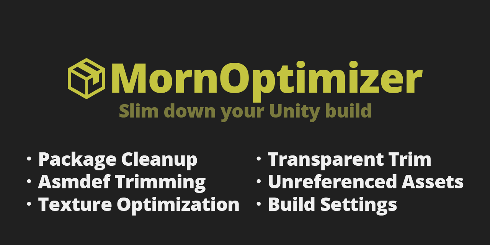

# MornOptimizer

<p align="center">
  
</p>

<p align="center">
  <b>Slim down your Unity build</b>
</p>

<p align="center">
  
</p>

<p align="center">
  <b>Package Cleanup</b> · <b>Asmdef Trimming</b> · <b>Texture Optimization</b><br/>
  <b>Transparent Trim</b> · <b>Unreferenced Assets</b> · <b>Build Settings</b>
</p>

## 概要

MornOptimizer は、Unity プロジェクトの不要なパッケージ・asmdef・テクスチャ設定・未参照アセットを検出し、ビルドサイズを削減するためのエディタウィンドウです。
`Tools > MornOptimizer` から開けます。

## 導入方法

Unity Package Manager で以下の Git URL を追加:

```
https://github.com/TsukumiStudio/MornOptimizer.git
```

`Window > Package Manager > + > Add package from git URL...` に貼り付けてください。

## 機能

### パッケージ

- **未使用パッケージ検出** — DLL参照・型リフレクション・Scene/Prefab・ファイル拡張子・パッケージ間参照の5層で判定
- **Feature展開** — `com.unity.feature.2d` 等をサブパッケージに分解して個別判定
- **連鎖削除** — 未使用パッケージ選択時、連鎖で不要になるパッケージを1段階ずつ表示
- **削除バリデーション** — 他パッケージから参照されているパッケージの削除をブロック

### Asmdef詳細

- **asmdef単位の使用判定** — Assets/コード・Scene/Prefab・パッケージ間参照（CompilationPipelineベース）で解析
- **カスタムパッケージ化** — パッケージを `CustomPackages/` にコピーし、選択したasmdefを削除
- **依存クリーンアップ** — 削除後、`package.json` の不要な依存を自動除去
- **連鎖検出** — 削除で不要になるasmdefを連鎖的に表示

### テクスチャ

- **MaxSizeチェック** — 元画像より大きい MaxSize を検出・修正
- **圧縮チェック** — 非圧縮テクスチャを検出・修正
- **ミップマップチェック** — UI/Sprite の不要なミップマップを検出・修正

### 余白トリム

- **透明余白の検出** — アルファ値でしきい値判定し、非透明領域を特定
- **4の倍数アライメント** — トリミング後のサイズを4の倍数に調整
- **削減量表示** — 推定ファイルサイズ削減量をソート表示

### 未参照アセット

- **依存解析** — Scene・Prefab・ScriptableObject からの依存を解析
- **グループ表示** — 型ごとにグループ化し、ファイルサイズ付きで表示
- **個別削除** — 各アセットを選択・削除ボタンで操作
- ※ `Resources.Load()` や Addressables 経由の参照は検出不可

### ビルド設定

- **Scripting Backend** — IL2CPP を推奨
- **Managed Stripping Level** — High を推奨
- **Development Build** — OFF を推奨
- **WebGL圧縮** — Gzip を推奨（unityroom 等が Brotli 非対応のため）

## 注意事項

- パッケージ削除やasmdefカスタム化は**元に戻せない操作**です
- 実行前に必ず git コミットまたはバックアップを作成してください
- `CustomPackages/` のパッケージはパッケージマネージャーの自動更新対象外です

## ライセンス

[The Unlicense](LICENSE)
